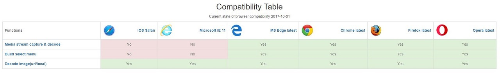
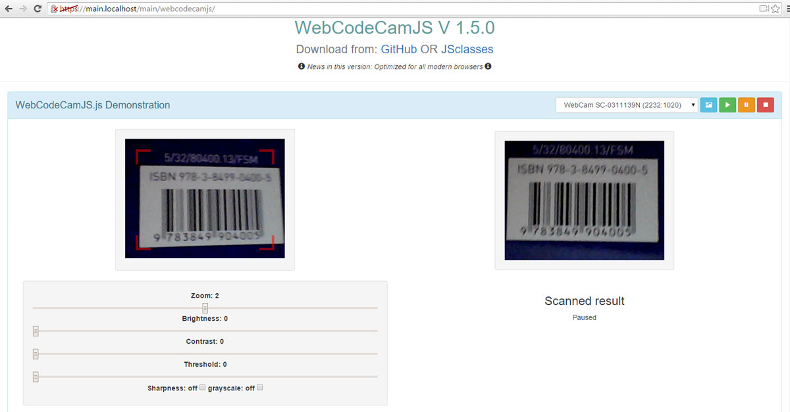

WebCodeCamJS & WebCodeCamJQuery
===============================

New versions of popular WebCodeCam jQuery plugin 

    - Very simple usage
    - Some option for optimal result
    - Quick implementation
    - Optimized for all modern browsers

Advantages compared to the previous version: 

    - Built in camera selector menu creation
    - Faster
    - Lower CPU and Memory usage
    - More configurable

* [Homepage] - Home page, demonstration

Version
----

2.7.0

    - Extend Browser compatibility

Version
----

2.1.0

    - Extend BuildSelectMenu function

Version
----

2.0.5

    - Add parameter tryVertical to options
    - Some minor modification

Version
----

2.0.1

    - Add parameter successTimeout to options
    - Add parameter codeRepetition to options

Version
----

2.0.0

    - Add UPC-A, UPC-E support, result function return value changed!

Version
----

1.9.1

    - Add default cameraindex parameter to buildSelectMenu, optional

Version
----

1.9.0

    - Add function: decode image from url

Version
----

1.8.0

    - Add function: decode local image

Version
----

1.7.0

    - Add jquery version (WebCodeCamJQuery)

Version
----

1.5.0

    - Optimized for all modern browsers
    - Refactor functions

Version
----

1.0.0

    - Very simple usage
    - Some option for optimal result
    - Quick implementation

Included decoders
-----------

barcode decoder ([DecoderWorker.js])

qr-decoder ([qrcodelib.js])
 

License
----

MIT

Author: Tóth András
---
http://atandrastoth.co.uk/

2015-06-10

[Homepage]:http://atandrastoth.co.uk/main/pages/plugins/webcodecamjs/
[WebCodeCamJS]:https://andrastoth.github.io/webcodecamjs/
[DecoderWorker.js]:https://github.com/EddieLa/BarcodeReader
[qrcodelib.js]:https://github.com/LazarSoft/jsqrcode
